# OpenBlock Labs Data Scientist Take-Home Assignment

## Contacts
##### ARMAND MORIN

armand_morin@berkeley.edu

https://www.linkedin.com/in/armand-morin/

# Liquidity of the pool ETH - USDC

# Basics Stats
### Density of Upper and Lower bounds of positions minted
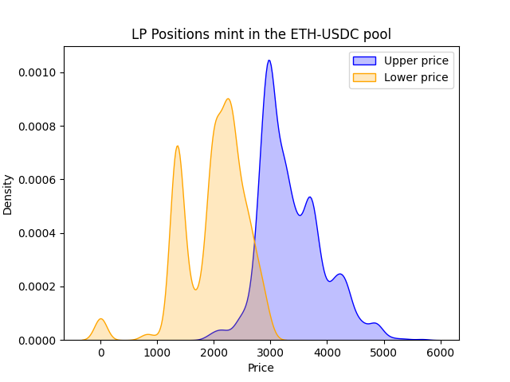

### Scatter history of Upper and Lower bounds of positions minted
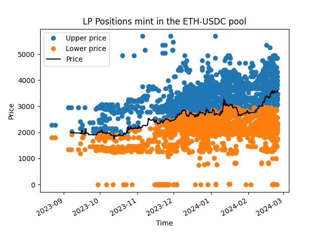

# Top Traders positions 
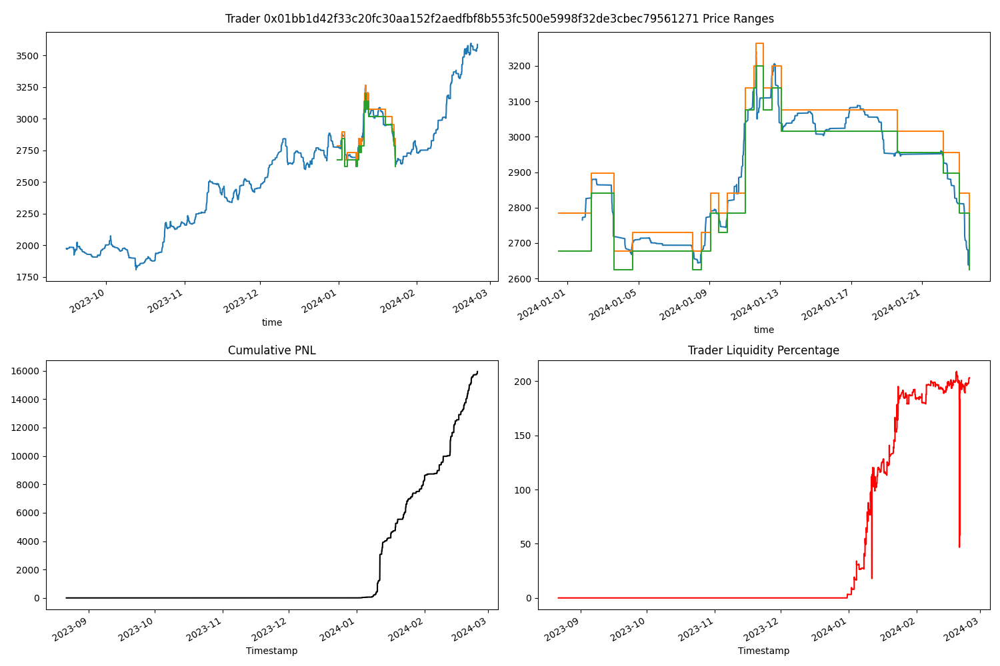

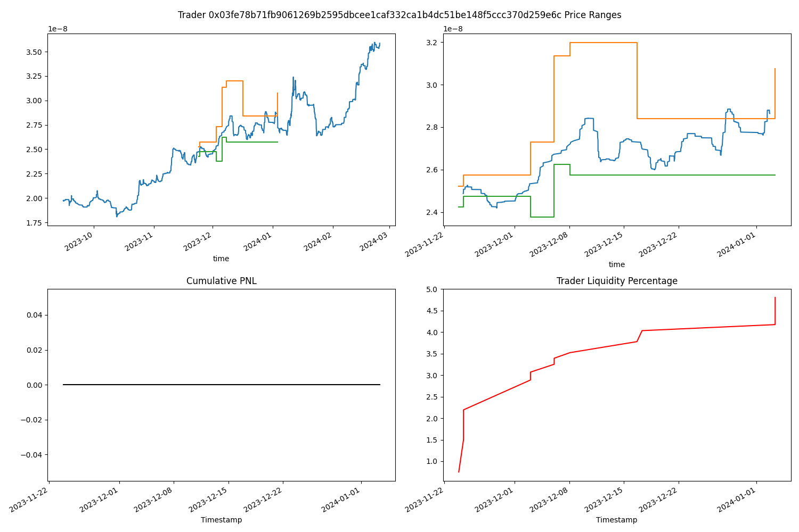
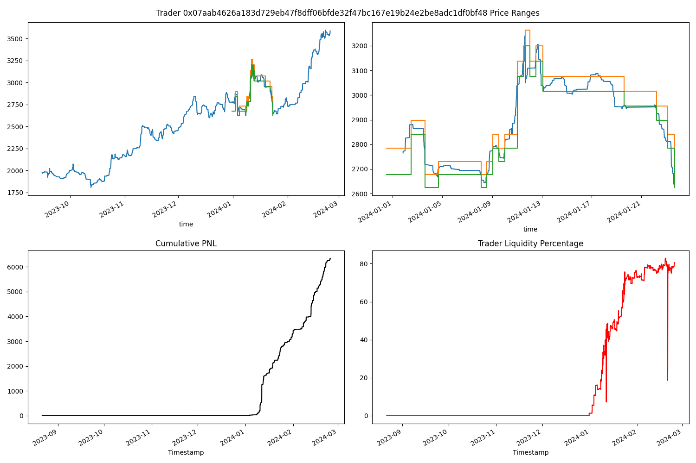
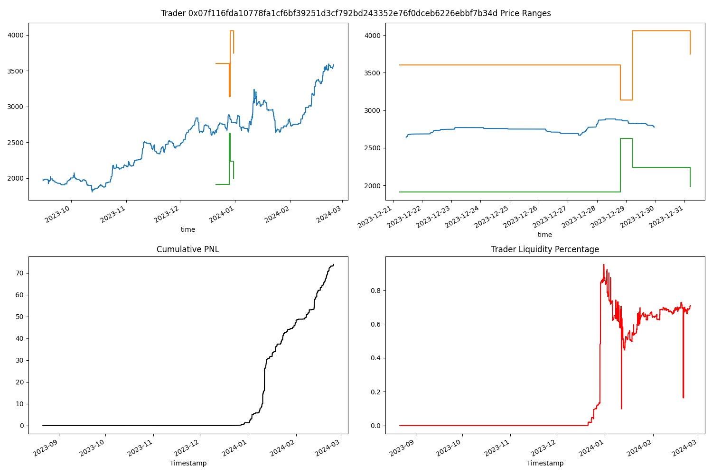
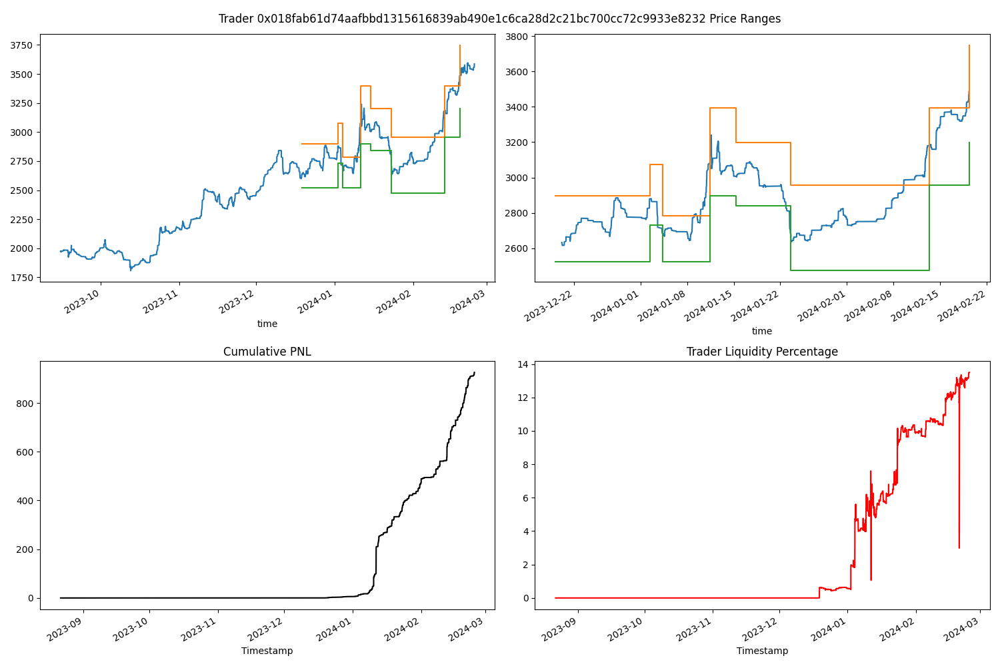
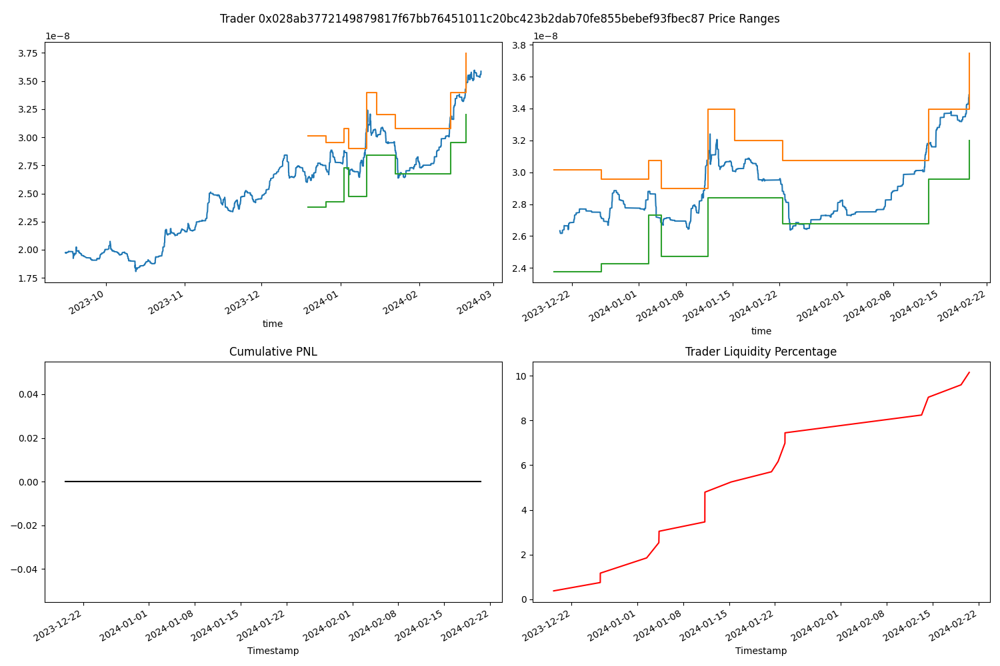
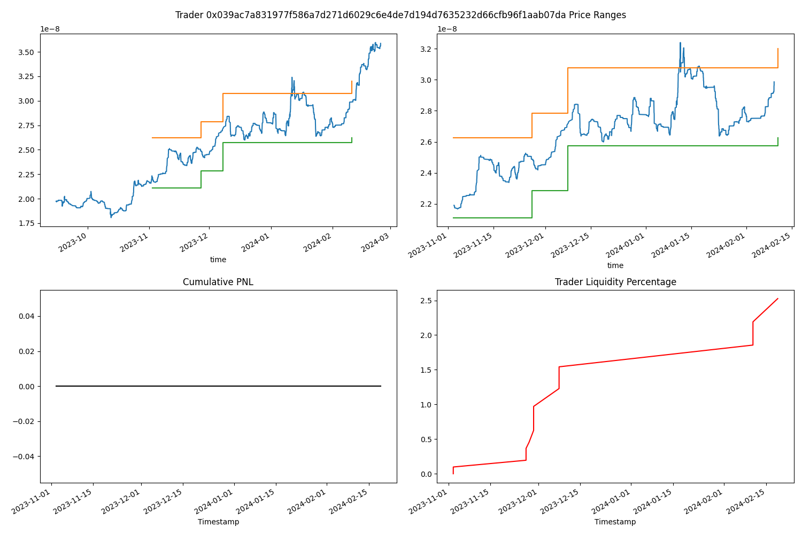
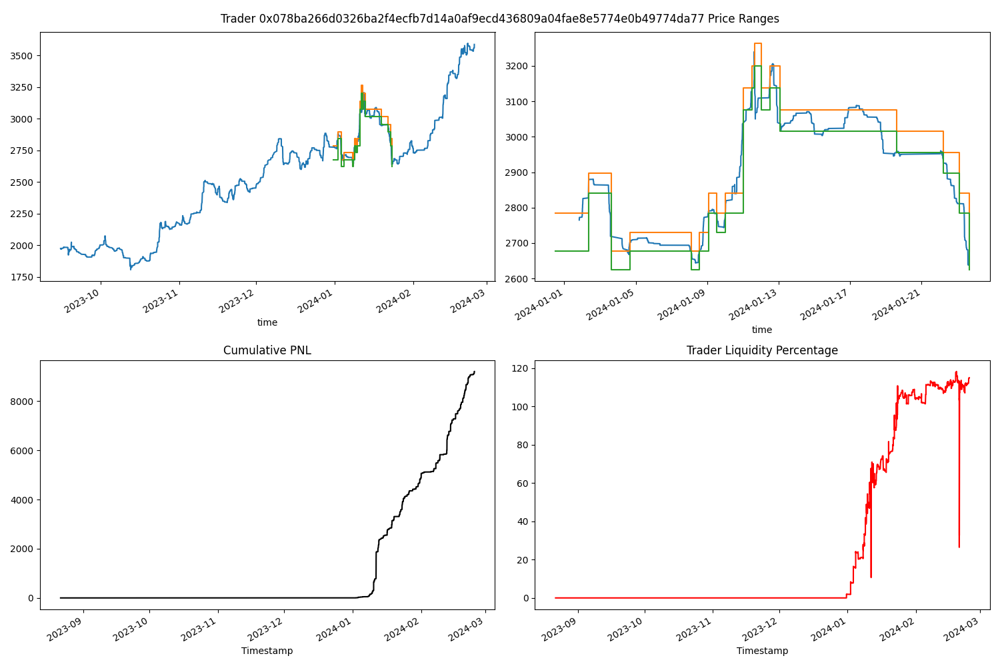
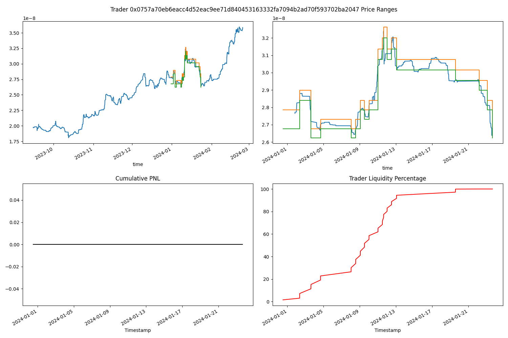

