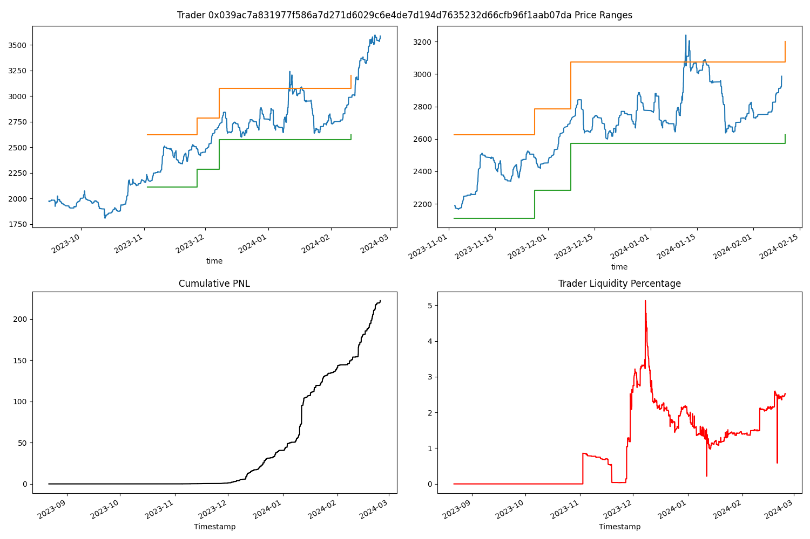

# Ekubo Starknet pool analytics

## Contacts details
##### ARMAND MORIN

email   : armand_morin@berkeley.edu

telegram: https://t.me/Zigouli

linkedin: https://www.linkedin.com/in/armand-morin/

# Considerations

I've arbitrarily chosen a particular pool, but it's possible to change this variable and redo all the calculations using data from another pool. The code is modular and allows this type of change perfectly.

Token 0 address: `0x049d36570d4e46f48e99674bd3fcc84644ddd6b96f7c741b1562b82f9e004dc7`
Token 1 address: `0x053c91253bc9682c04929ca02ed00b3e423f6710d2ee7e0d5ebb06f3ecf368a8`
Mainnet Core contract address: `0x00000005dd3d2f4429af886cd1a3b08289dbcea99a294197e9eb43b0e0325b4b`

# Liquidity of the pool ETH - USDC
This gif is showing the liquidity shape of the pool mooving over time as traders are minting and buring positions

# Pool Depth
We have the following results for the depth of the pool at the end of the data for the `current price of $ 3629 ETH/USD`:
| Depth % | Lower Price | Upper Price | Lower Tick | Upper Tick | Market Depth ($) |
|---------|-------------|-------------|------------|------------|--------------------|
| 20      | 3024        | 4354        | -19616745  | -19252101  | $ 5.401M |
| 10      | 3299        | 3991        | -19529733  | -19339113  | $ 2.772M |
| 5       | 3456        | 3810        | -19483213  | -19385633  | $ 2.566M |

You can see that the value of my walking depth decreases with the percentage of depth you select. This is perfectly coherent.
Here at this moment I had several other ideas of how to have better ways to visualize this type of variables and I would be happy to detail it orally.

# Basics Stats
### Density of Upper and Lower bounds of positions minted

### Scatter history of Upper and Lower bounds of positions minted

# Top Traders positions 
Graph of the LP positions history of a trader and a zoom on the period she was trading.
Cumulative PNL for LP positions (no swap considered here).
Liquidity percentage in the pool for each traders to know how much each trader is accounting for the total liquidity of the pool.

# Conclusion
Due to the confidential nature of this type of work, I have chosen not to disclose all results that i worked on during the past few months within this document. I welcome the opportunity for a discussion to comprehensively review the findings in this notebook and to elaborate on my research methodology. I have developped powerfull tools to automate many things on my side and would be gratefull to discuss it. In such a conversation, I can also outline potential future directions and improvements that could be realized with additional time allocated to this project.

